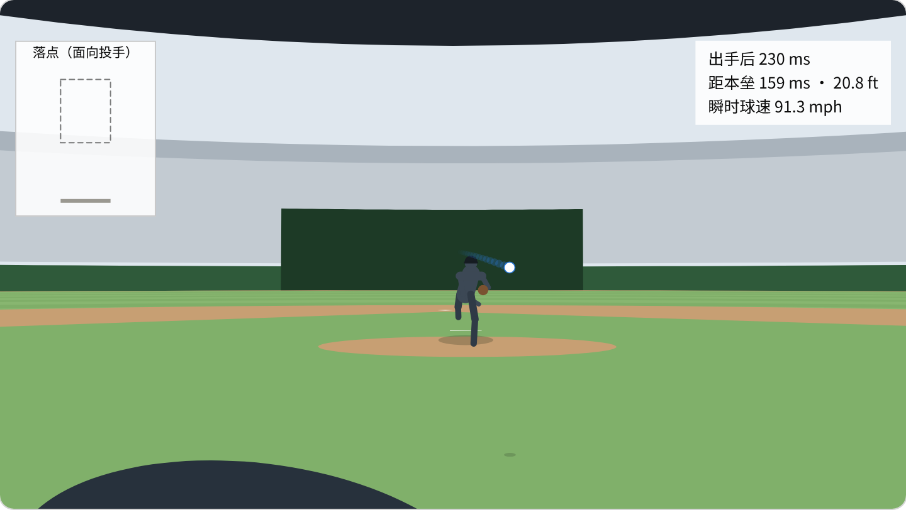
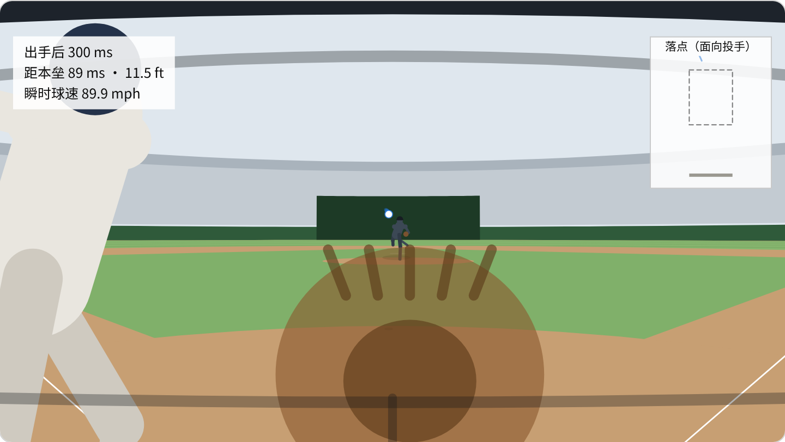
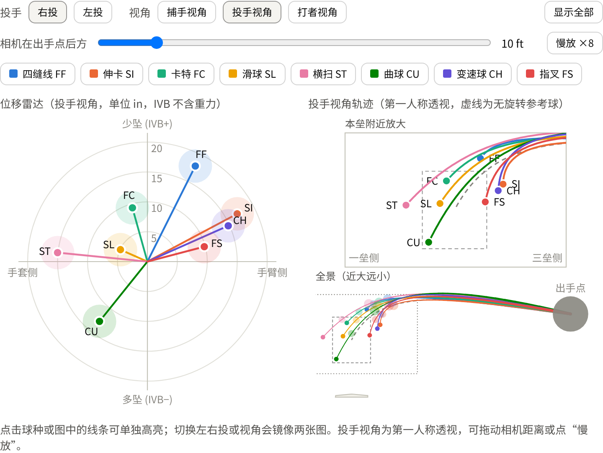
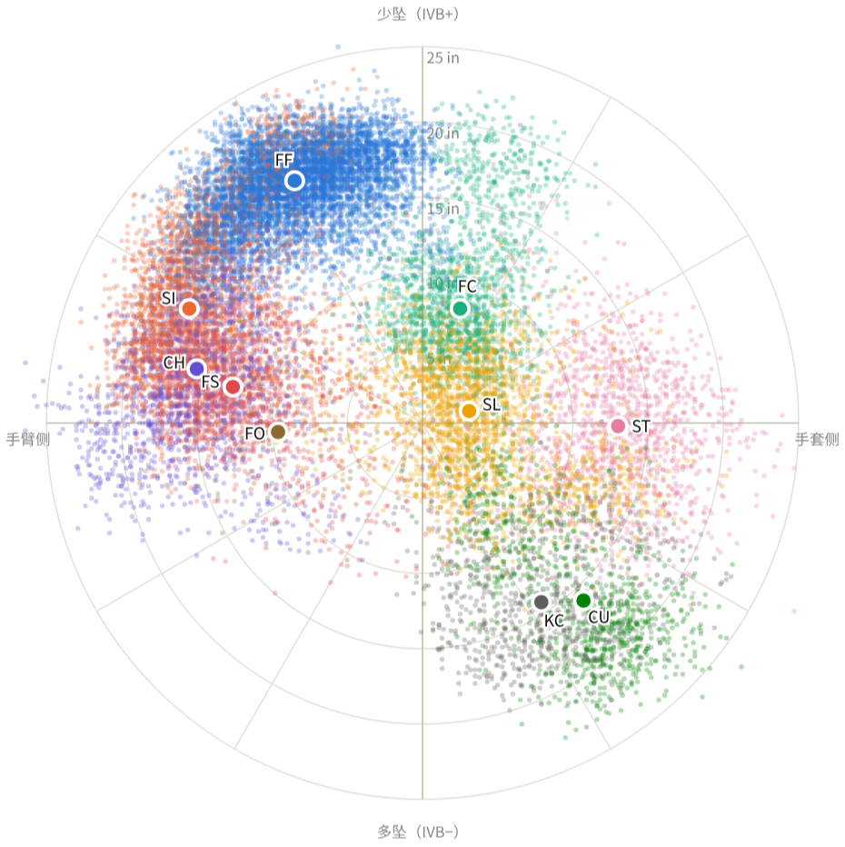
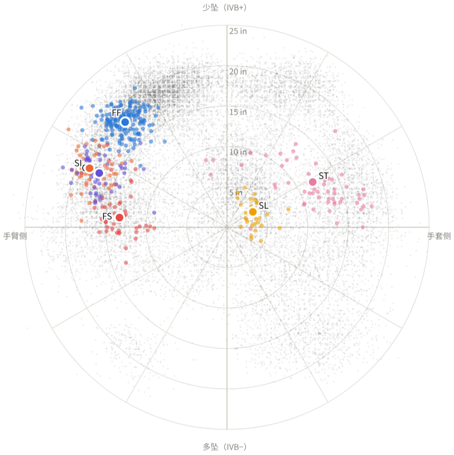

# Pitch Trajectory Explorer · 棒球球种轨迹实验室

用真实的 MLB Statcast 逐球数据，从**捕手、投手、打者**三个视角理解棒球各球种的位移与轨迹，并在打者 / 捕手第一人称视角下模拟完整打席。

整个工具是一个**离线可用的单文件网页**（`index.html`，约 1.5 MB），双击即可在浏览器打开，无需安装任何依赖。

**在线体验：** <https://kunzehe.github.io/pitch-trajectory-explorer/>

<p align="center">
  
  
</p>

---

## 功能概览

页面分为三个标签页。

### 1. 球种模型



- **位移雷达**：8 个主流球种（四缝线、伸卡、卡特、滑球、横扫、曲球、变速球、指叉）的典型诱导竖直位移（IVB）与水平位移（HB），以极坐标形式展示方向与大小。
- **轨迹图**，三种视角可切换：
  - **捕手视角**：正投影；
  - **投手视角**：第一人称透视，相机距离可调，并有本垒附近放大图；
  - **打者视角**：标出挥棒决策点，并演示隧道效应——按典型值计算，离本垒 24 ft 时各球种之间最多相差约 9 in，到本垒时会拉开到约 31 in。
- 支持左投 / 右投、左打 / 右打镜像，以及 ×8 慢放动画。

### 2. 真实数据 · MLB 投手

<p>
  
  
</p>

- **数据**：2026 赛季 **52 名投手**（覆盖全部 30 队，约 12 万球）与 2025 赛季 15 名投手的常规赛逐球数据，可按赛季切换。
- **散点图**：每个点是一球，按球种着色；大圆点为各球种的中位数。
- **按球队筛选**：投手卡片带球队徽章（缩写加队色），赛季中转队的投手按先后显示多支球队。
- **单个投手**：点开可查看该投手的球路组合表（使用率、球速、转速、IVB、HB）。
- **三种视角**：捕手 / 投手 / 打者；打者视角下按左右打标注内角与外角。

### 3. 打击视角

- **身份**：可选**打者**或**捕手**，均为第一人称。
  - **打者**：站在打击区内，可见头盔帽檐和前肩。
  - **捕手**：蹲在本垒后方，可见面罩、手套和打击区里的打者。
- **实战模式**：一个打席为一轮，3 好球三振、4 坏球保送，打进场内即结束。
  - **投球**：每球从所选投手的真实投球中随机抽取。
  - **节奏**：投手先站定，再进入固定姿势（停顿时间随机），然后抬腿、跨步、出手。
  - **打者操作**：按空格挥棒，按挥棒时机误差判定为空挥、界外、安打（一垒、二垒、全垒打）或击出出局，并有击球飞行动画与合成音效。
  - **捕手操作**：用鼠标移动手套接球，打者由电脑控制。
  - **统计**：累计打击率、三振、保送、接球率等。
- **观察模式**：拖动时间轴，以毫秒精度查看球的位置。
  - 时间轴标出决策点（−175 ms）、开始挥棒（−150 ms）和到达本垒；
  - 可叠加两种球路对比；
  - 实战中的任意一球都可以「回看」。

---

## 物理模型与数据处理

### 坐标与位移定义

采用 Statcast 坐标系，单位为英尺：

- **原点**：本垒板后尖；
- **$x$ 轴**：指向一垒侧（捕手视角下的右方）；
- **$y$ 轴**：指向投手；
- **$z$ 轴**：竖直向上。

本垒板前缘位于 $y = 17/12\ \text{ft}$。

- **诱导竖直位移（IVB）**：扣除重力后、由旋转（马格努斯力）和缝线尾流效应产生的竖直位移，取 Statcast 的 `pfx_z`：

$$
\mathrm{IVB} = 12\, p_{fx,z} \quad (\text{in})
$$

- **水平位移（HB）**：统一换算为「手臂侧为正」，这样左右投可以直接比较：

$$
\mathrm{HB} =
\begin{cases}
-12\, p_{fx,x}, & \text{右投}\\[2pt]
+12\, p_{fx,x}, & \text{左投}
\end{cases}
\quad (\text{in})
$$

### 完整轨迹：Statcast 9 参数模型

打击视角中的轨迹不是示意，而是用 Statcast 为每一球提供的匀加速拟合参数重建的：在 $y_0 = 50\ \text{ft}$ 处的速度 $(v_{x0}, v_{y0}, v_{z0})$ 与加速度 $(a_x, a_y, a_z)$。其中 $a_y > 0$ 体现了空气阻力造成的减速。

$$
\mathbf{r}(t) = \mathbf{r}_0 + \mathbf{v}_0\, t + \tfrac12\, \mathbf{a}\, t^2,
\qquad \mathbf{r}_0 = (x_0,\ 50,\ z_0)
$$

CSV 中没有直接给出 $x_0$ 与 $z_0$，由过本垒前缘时的位置 $(p_x, p_z)$ 反推。先求球到达任意平面 $y = Y$ 的时刻：

$$
t(Y) = \frac{-v_{y0} - \sqrt{v_{y0}^2 - 2 a_y (50 - Y)}}{a_y}
$$

令 $t_p = t(17/12)$，则

$$
x_0 = p_x - v_{x0} t_p - \tfrac12 a_x t_p^2, \qquad
z_0 = p_z - v_{z0} t_p - \tfrac12 a_z t_p^2
$$

出手时刻为 $t_r = t(y_{\text{release}})$，飞行时间为 $T = t_p - t_r$。

**自洽性检验**（2026 赛季约 12 万球）：用上述方法反推到出手时刻，与 CSV 记录的出手位置相比，水平误差 $0.2 \pm 0.3$ in，竖直误差 $-1.0 \pm 0.3$ in；反推的出手球速与 `release_speed` 相差 $-0.04 \pm 0.07$ mph。飞行时间分布在 350–590 ms，中位数 410 ms。

### 其他处理

- **零星球种剔除**：单个投手中占比低于 2% 且不足 30 球的球种，视为自动分类误差剔除。
- **联盟典型**：取该赛季全部右投各球种 9 参数的中位数；左投由右投镜像得到（$x_0, v_{x0}, a_x$ 取反）。
- **散点抽样**：每人随机抽取 400–600 球，以控制页面体积；表格与中位数仍使用全季数据。
- **球队判定**：由每场比赛的主客队与上下半局推出（上半局投球的是主队）。

### 打席模拟中的判定（游戏规则，非数据拟合）

挥棒时机误差定义为

$$
e = (t_{\text{swing}} + 150\ \text{ms}) - T
$$

即假设挥棒耗时约 150 ms。球每偏离好球带 1 ft，额外计 45 ms 的等效误差：

$$
e_{\text{eff}} = |e| + 45\, d_{\text{out}}
$$

| $e_{\text{eff}}$ | 结果 |
|---|---|
| ≤ 22 ms | 打进场内：误差越小越可能是长打，否则可能被接杀或封杀出局 |
| 22–40 ms | 界外（早挥在拉打侧，晚挥在反方向） |
| > 40 ms | 空挥 |

以下参数都是为了游戏手感而设定的经验值，个体差异很大：决策点 175 ms、挥棒 150 ms、上表的阈值、电脑打者的挥棒概率。好球带取 1.6–3.4 ft 的通用高度。

---

## 项目结构

```
pitch-trajectory-explorer/
├── index.html                  # 构建产物：单文件交互页面（GitHub Pages 入口）
├── src/
│   ├── model.html              # 「球种模型」标签页
│   ├── realdata.html           # 「真实数据」标签页模板
│   └── batting.html            # 「打击视角」标签页（三维场景、打席逻辑、音效）
├── scripts/
│   ├── download_statcast.sh    # 从 Baseball Savant 下载名单内投手的逐球 CSV
│   ├── build.py                # 处理数据并把三个标签页合成 index.html
│   └── pitch_plots.py          # 生成 figures/ 下的静态图（matplotlib）
├── data/
│   ├── pitchers_2026.txt       # 2026 投手名单（MLBAM ID + 注释）
│   ├── pitchers_2025.txt       # 2025 投手名单
│   └── raw/                    # 下载的原始 CSV（不纳入版本控制）
├── figures/                    # 静态位移雷达图 / 轨迹图（PNG + SVG）与截图
└── requirements.txt
```

## 快速开始

只想使用：直接打开 `index.html`，或访问上面的在线地址。

想更新数据或修改页面：

```bash
pip install -r requirements.txt

# 1. 下载数据（每位投手约 1–2 MB；需能访问 baseballsavant.mlb.com）
scripts/download_statcast.sh 2026
scripts/download_statcast.sh 2025

# 2. 构建页面（自动扫描 data/raw/<赛季>/，最新赛季为默认）
python scripts/build.py

# 3.（可选）重新生成静态图
python scripts/pitch_plots.py
```

**增删投手**：在 `data/pitchers_<赛季>.txt` 中增删 MLBAM ID（可在 Baseball Savant 球员页面的网址中找到），重新下载后再构建即可。日本投手的汉字名、少数招牌球说明在 `scripts/build.py` 的 `ZH_NAME` 与 `SIGNATURE` 中维护；其余投手的简介由数据自动生成。

**修改页面**：编辑 `src/` 下的模板，然后重新运行 `python scripts/build.py`。

## 数据来源与声明

- 逐球数据来自 [Baseball Savant](https://baseballsavant.mlb.com/)（Statcast），版权归 MLB Advanced Media 所有。本仓库不包含原始数据，只提供下载脚本，构建出的页面内含经抽样和聚合的数据，仅供学习与研究使用。字段定义见 [Statcast CSV 文档](https://baseballsavant.mlb.com/csv-docs)。
- 球种标签沿用 Statcast 的自动分类。例如 Skenes 的 splinker 记为 FS，千贺滉大的「幽灵叉球」记为 FO。
- 页面中的投手、打者均为不对应任何真实球员的示意人形，动作为通用关键帧动画，只有出手点来自数据。页面不使用任何球队的官方队标，球队仅以缩写和队色徽章表示。
- 音效由浏览器 Web Audio 实时合成。

## License

代码以 [MIT License](LICENSE) 发布。数据的使用须遵守 MLB / Baseball Savant 的相关条款。
